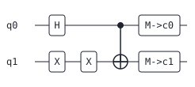
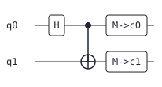
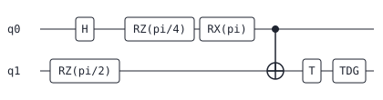
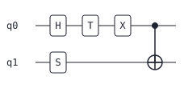

# Daedalus — a toy quantum-circuit compiler whose optimizations are proven correct by simulation

[](https://github.com/GreenPandaTech/Daedalus/actions/workflows/ci.yml)

*Daedalus — the master craftsman who built the Labyrinth; this one crafts
quantum circuits and proves its rewrites never lose the way.*

**A toy educational quantum-circuit DSL compiler with *verified* optimization,
an *exact* unitary proof mode, a *verified* SWAP-insertion router, and a
standalone two-circuit equivalence prover with delta-debugged counterexamples.
Pure Python stdlib — zero runtime dependencies.**

Daedalus compiles a small quantum-circuit DSL through a real compiler pipeline
(lexer → recursive-descent parser → IR → pass manager), *proves* its
optimizations did not change the circuit's meaning, and can then route it onto a
hardware coupling map — proving *that* correct too. The spine of the whole
project is one idea: **nothing is trusted that the equivalence oracle cannot
certify.** Even the [routing benchmark](#benchmark-sabre-vs-greedy-on-the-examples)
below is the verbatim output of `python -m daedalus.bench`, including the rows
where the smarter router does not win.

> **Honest framing:** this is a teaching compiler for learning and portfolio
> purposes. It has a real compiler architecture, simulation-verified rewrites,
> an exact small-circuit proof engine, and an abstract-coupling-map router — but
> it is not a production quantum compiler (no hardware backends, no device
> calibration, no noise models — see Limitations).

## Why it is interesting

Most toy compilers *claim* their optimizations are correct. Daedalus checks two
ways:

- **Randomized** — every optimized circuit is re-simulated against the original
  on a deterministic battery of basis states and seeded pseudo-random inputs,
  and must agree up to global phase. This scales to 10 qubits.
- **Exact** — for small circuits it builds the full `2ⁿ×2ⁿ` unitary and compares
  the two circuits exactly, reporting the Frobenius difference norm and process
  fidelity. This is a genuine proof, not evidence.

```
$ daedalus compile examples/rotations.qf --opt --proof --emit ascii
proof: exact unitary check, equivalent up to global phase (diff norm 3.140e-16, process fidelity 1.0000000000, dimension 4)
BEFORE:
q0: -[RZ(pi/4)]--[RZ(pi/4)]---o---[RZ(-pi/2)]-----------------------
                              |
q1: -------------------------(+)--[RX(pi/2)]---[RX(-pi/2)]--[M->c0]-

AFTER:
q0: --o-----------
      |
q1: -(+)--[M->c0]-

gates: 7 -> 2
```

Seven gates collapse to two: the adjacent `rz(pi/4)` pair merges to `rz(pi/2)`,
which *commutes through the cx control* and cancels against `rz(-pi/2)`; the `rx`
pair merges to `rx(0)` and evaporates — and the exact unitary confirms the result
is the same operator.

## The DSL

```
# Bell pair with a redundant x x pair the optimizer removes.
qubits 2
bits 2
h q0
x q1
x q1
cx q0, q1
barrier q0, q1     # optional optimization fence (see below)
measure q0 -> c0
measure q1 -> c1
```

DSL source files use the `.qf` extension. Gates:
`h x y z s sdg t tdg rx(a) ry(a) rz(a) cx cz swap measure`, plus `barrier` as a
scheduling fence. Angles support pi arithmetic (`pi/4`, `-pi/2`, `2*pi`) via a
tiny safe expression evaluator — no `eval`. Parse errors carry line and column:

```
bad.qf:2:1: error: unknown gate 'foo'
```

## Optimization passes

| pass | what it does |
|---|---|
| `cancel-inverses` | removes adjacent self-inverse pairs (`h h`, `x x`, `cx cx`, `s sdg`, `t tdg`, …) |
| `merge-rotations` | fuses adjacent same-axis rotations, drops angles that are 0 mod 2pi |
| `peephole` | Hadamard-conjugation identities: `h x h → z`, `h z h → x`, `h y h → y`, and the basis-change rotations `h rz(a) h → rx(a)`, `h rx(a) h → rz(a)`, `h ry(a) h → ry(-a)` |
| `control-flip` | `h h cx h h → cx` reversed: a Hadamard sandwich flips a cx's direction (five gates to one) |
| `commute-cancel` | commutes z-diagonal gates through cx **controls** / cz, *and* x-type gates (`x`, `rx`) through cx **targets**, to expose cancellations |
| `canonicalize-rotations` | lowers special-angle rotations to named Clifford+T gates (`rz(pi/2)→s`, `rz(pi/4)→t`, `rx(pi)→x`, …); drops identity rotations |
| `dead-code` | *(off by default, `--dce`)* drops gates on never-measured qubits; documented as observably unsafe if you inspect the full state |

The pass manager runs passes to a fixpoint and reports per-pass statistics plus
depth:

```
$ daedalus stats examples/clifford_t.qf
pass               iter  before  after  removed
cancel-inverses       1       7      5        2
merge-rotations       1       5      5        0
...
total: 7 -> 5 gates (28.6% reduction)
depth: 6 -> 4
```

Every pass is proven semantics-preserving by the test suite, which re-verifies
each rewrite with the equivalence checker (and, for small circuits, the exact
unitary). A **`barrier`** is an optimization fence: no pass may move a gate
across it. Every pass is tested to fire without a fence and to be blocked by one.

## Verified routing onto a coupling map

Real hardware only allows two-qubit gates between *coupled* qubits. Daedalus can
route a logical circuit onto a coupling map — `line`, `ring`, `grid`, `full`, or
a custom edge list — by inserting SWAPs, and then **prove** the routed circuit
reproduces the original *up to the qubit permutation the SWAPs induce*. Two
strategies are shipped (`--strategy greedy|sabre`, greedy is the default):

```
$ daedalus route examples/routed_line.qf --coupling line --verify --emit ascii
routed onto a 4-qubit coupling map: 4 swap(s) added, depth 5 -> 8
final layout (logical -> physical): [1, 2, 0, 3]
verify: routed circuit equivalent up to the final layout (max error 0.000e+00, 10 inputs)
q0: -[H]--x------x------(+)---------------
          |      |       |
q1: ------x--x---x---x---o----------------
             |       |
q2: ---------x---o---x---o----------------
                 |       |
q3: ------------(+)------o---[T]--[M->c0]-
```

The default router is a deliberately simple greedy one (trivial initial layout,
no lookahead) — but it is *verified*: `check_routing_equivalence` embeds each
input under the initial layout, simulates the routed circuit, and compares the
output read back through the final layout, exact for small circuits. That is
the whole point: routing is only trustworthy because it is proven. With
`--verify` the router cannot silently ship a wrong circuit: a failed oracle
check refuses to emit anything and exits with code 3, and the test suite proves
both strategies on random circuits and on every example across all five
topologies.

### The sabre strategy

`--strategy sabre` is a **SABRE-lite** router after Li, Ding & Xie 2019
(*Tackling the Qubit Mapping Problem for NISQ-Era Quantum Devices*).
Implemented subset: the front layer of the dependency DAG, candidate SWAPs
scored by the summed BFS distance of the front layer plus a weighted lookahead
window of upcoming two-qubit gates, and reverse-traversal initial-layout
selection (one forward and one backward routing pass choose where each logical
qubit starts). *Not* implemented from the paper: the decay factor and multiple
reverse-traversal rounds. It is fully deterministic — no randomness, ties break
on the smallest candidate edge — and a greedy shortest-path fallback fires if
the heuristic stalls, so routing always terminates.

```
$ daedalus route examples/routed_line.qf --coupling line --strategy sabre --verify
routed onto a 4-qubit coupling map: 1 swap(s) added, depth 5 -> 6
initial layout (logical -> physical): [2, 1, 0, 3]
final layout (logical -> physical): [1, 2, 0, 3]
verify: routed circuit equivalent up to the final layout (max error 0.000e+00, 10 inputs)
```

One swap instead of greedy's four on the same circuit: the reverse traversal
places the busy qubits adjacently before the pass starts. Because sabre picks a
non-trivial *initial* placement, the oracle takes it into account:
`check_routing_equivalence(original, routed, final_layout, initial_layout=...)`
places each test input through the initial layout and reads the output back
through the final layout — every sabre-routed circuit in the test suite is
proven equivalent this way across all five topologies.

### Benchmark: sabre vs greedy on the examples

Measured on the committed example circuits (regenerate with
`python -m daedalus.bench`; the table below is that command's verbatim output).
`swaps` = SWAP gates inserted; `depth` = routed depth minus the original
circuit's depth, using the repo's span-blocking moment metric.

| circuit | topology | swaps greedy | swaps sabre | depth greedy | depth sabre |
|---|---|---:|---:|---:|---:|
| bell | line:4 | 0 | 0 | +0 | +0 |
| bell | ring:4 | 0 | 0 | +0 | +0 |
| bell | grid:2x2 | 0 | 0 | +0 | +0 |
| bell | grid:2x3 | 0 | 0 | +0 | +0 |
| bell | full:4 | 0 | 0 | +0 | +0 |
| ghz | line:4 | 0 | 0 | +0 | +0 |
| ghz | ring:4 | 0 | 0 | +0 | +0 |
| ghz | grid:2x2 | 1 | 0 | +1 | +0 |
| ghz | grid:2x3 | 0 | 0 | +0 | +0 |
| ghz | full:4 | 0 | 0 | +0 | +0 |
| rotations | line:4 | 0 | 0 | +0 | +0 |
| rotations | ring:4 | 0 | 0 | +0 | +0 |
| rotations | grid:2x2 | 0 | 0 | +0 | +0 |
| rotations | grid:2x3 | 0 | 0 | +0 | +0 |
| rotations | full:4 | 0 | 0 | +0 | +0 |
| qft3 | line:4 | 1 | 1 | -1 | +1 |
| qft3 | ring:4 | 1 | 1 | -1 | +1 |
| qft3 | grid:2x2 | 2 | 1 | +1 | +1 |
| qft3 | grid:2x3 | 1 | 1 | -1 | +1 |
| qft3 | full:4 | 0 | 0 | +0 | -1 |
| clifford_t | line:4 | 0 | 0 | +0 | +0 |
| clifford_t | ring:4 | 0 | 0 | +0 | +0 |
| clifford_t | grid:2x2 | 0 | 0 | +0 | +0 |
| clifford_t | grid:2x3 | 0 | 0 | +0 | +0 |
| clifford_t | full:4 | 0 | 0 | +0 | +0 |
| routed_line | line:4 | 4 | 1 | +3 | +1 |
| routed_line | ring:4 | 1 | 1 | +1 | +1 |
| routed_line | grid:2x2 | 2 | 0 | +2 | +0 |
| routed_line | grid:2x3 | 1 | 1 | +1 | +1 |
| routed_line | full:4 | 0 | 0 | +0 | +0 |

**Honest read:** these are tiny circuits (2–4 qubits), so this says nothing
about routing quality at scale. On them, sabre never inserts *more* swaps than
greedy and wins outright where layout matters (`routed_line` on `line:4`: 4
swaps → 1; `ghz` and `routed_line` on `grid:2x2`: down to 0). But it does not
dominate: on `qft3` over `line:4`, `ring:4`, and `grid:2x3` both insert 1 swap
and **greedy ends 2 moments shallower** than sabre (depth −1 vs +1) — the
depth metric is span-blocking, so sabre's non-trivial placement can cost
diagram moments even at equal swap count.

## Any two circuits: `daedalus equiv`

The oracle that certifies the optimizer and the router is also exposed
directly: `daedalus equiv A B` proves *any* two circuits (DSL or QASM, mixed
freely) equivalent up to global phase — exact unitary up to 7 qubits, the
randomized battery above that. Comparing a circuit against its optimized form:

```
$ daedalus compile examples/bell.qf --opt --emit ir --out bell_opt.qf
$ daedalus equiv examples/bell.qf bell_opt.qf
proof: exact unitary check, equivalent up to global phase (diff norm 0.000e+00, process fidelity 1.0000000000, dimension 4)
note: measure gates are ignored - the verdict compares pre-measurement statevectors, so circuits measuring different qubits can still be equivalent here
```

That note is printed whenever either input contains a `measure` gate: the
verdict is about pre-measurement statevectors (the simulator's documented
semantics), so two circuits that differ only in *what they measure* count as
equivalent under this convention — and the tool says so rather than handing
back an unqualified green.

On failure it does not just say "no". It emits a **counterexample witness** —
a concrete input where the outputs disagree, with the worst amplitude rows
showing both the phase-aligned error `|B - phase*A|` and the raw `|B - A|`
difference — and then **delta-debugs** the failing pair with the classic ddmin
algorithm (Zeller & Hildebrandt 2002) over the union of both gate lists. Here
`a.qf` and `b.qf` are a Bell preparation ending in `t q1` vs `tdg q1`:

```
$ daedalus equiv a.qf b.qf
proof: exact unitary check, NOT equivalent (diff norm 2.000e+00, process fidelity 0.7071067812, dimension 4)
counterexample witness: input |00> (battery input 0)
  disagreeing amplitudes (error = |B - phase*A|, raw = |B - A|, shared phase +1.000000+0.000000j):
    |11>: A +0.500000+0.500000j  B +0.500000-0.500000j  error 1.000e+00  raw 1.000e+00
delta-debug shrink: 6 -> 1 gates across the pair (4 oracle calls)
1-minimal: removing any single remaining gate makes the pair equivalent
  A (1 gate(s)):
    h q0
  B (0 gate(s)):
    (no gates)
```

**Honest read of that shrink:** 1-minimal means a *minimal explanation of the
disagreement*, not the textual diff of the two programs — here ddmin
legitimately lands on `h q0` vs the empty circuit, a pair that already
disagrees all by itself. The test suite asserts the 1-minimality property of
every shrink (still failing, and dropping any single remaining gate restores
equivalence) rather than hardcoding expected gate lists. `--no-shrink` skips
the ddmin pass, `--json` emits the whole verdict — witness, shrink, and the
`measure_ignored` flag — as strict JSON, and a proven non-equivalence exits
with code 3, same as `--verify`/`--proof` refusals.

## Resource analysis and the dependency DAG

```
$ daedalus analyze examples/qft3.qf
qubits: 3    bits: 0
operations: 19
depth: 16
1-qubit gates: 12
2-qubit gates: 7
T-count (t+tdg): 0
gate histogram:
  cx: 6
  ...
```

`analyze` reports depth, gate mix, two-qubit count, and **T-count** (the
dominant cost metric in fault-tolerant quantum computing); `--json` emits the
same numbers as JSON. `--emit dot` writes the IR's per-wire dependency DAG as
Graphviz (`daedalus compile FILE --emit dot | dot -Tsvg -o dag.svg`), making the
"the IR is effectively a DAG" claim literal.

SVG diagrams (committed under `examples/`, regenerable with
`daedalus compile … --emit svg --out …`):

| before | after `--opt` |
|---|---|
|  |  |
|  |  |

## OpenQASM 2.0 interop

Any circuit can be exported to OpenQASM 2.0 with `--emit qasm`, and `.qasm` files
compile directly. The importer accepts a documented *subset*: one `qreg` and at
most one `creg` (any names), the qelib1 gates
`h x y z s sdg t tdg rx ry rz cx cz swap`, `measure q[i] -> c[j]`,
`barrier q[i], …`, pi-arithmetic angles, and `//` comments, with indexed
operands only. User-defined `gate` blocks, `if`, `opaque`, `reset`, the `U`/`CX`
builtins, whole-register broadcast, and multiple registers are rejected with the
same precise `line:col` diagnostics as the DSL parser. The test suite round-trips
every example (original and optimized) through QASM and re-proves equivalence.

## The QFT, proven

`examples/qft3.qf` is a 3-qubit Quantum Fourier Transform written entirely in the
elementary gate set (each controlled-phase is decomposed into two `rz`s and two
`cx`s). `test_examples.py` builds its unitary and proves it equals the analytic
8-point DFT matrix up to global phase — a real algorithm, verified from first
principles.

## Install & run

Requires Python 3.10+ (developed on 3.13). Zero runtime dependencies; `pytest`,
`ruff`, and `mypy` are the only dev dependencies.

```bash
python -m venv .venv
.venv/Scripts/python.exe -m pip install -e ".[dev]"   # Windows
# .venv/bin/python -m pip install -e ".[dev]"          # Linux/macOS

.venv/Scripts/python.exe -m pytest -q                  # 493 tests
.venv/Scripts/python.exe -m ruff check .               # lint
.venv/Scripts/python.exe -m mypy src                   # strict types
```

CLI (also runnable as `python -m daedalus`):

```
daedalus compile FILE [--opt] [--emit ir|ascii|svg|qasm|dot] [--verify] [--proof] [--dce] [--out FILE]
daedalus route   FILE --coupling line|ring|full[:N]|grid:RxC [--strategy greedy|sabre] [--emit …] [--verify] [--out FILE]
daedalus equiv   FILE_A FILE_B [--no-shrink] [--json]
daedalus analyze FILE [--json]
daedalus stats   FILE [--dce]
```

Files ending in `.qasm` are parsed as OpenQASM 2.0; everything else as the DSL.
Exit codes: `0` success, `1` I/O error, `2` usage/syntax error, `3` verification
failed (`--verify`/`--proof` rejected a circuit, or `equiv` proved the pair not
equivalent).

## Architecture

```
src/daedalus/
  lexer.py       tokenizer with line/column tracking
  parser.py      recursive-descent parser -> Circuit IR
  angles.py      safe pi-arithmetic expression evaluator (no eval)
  ir.py          Circuit/Gate IR; per-qubit dependency chains (a DAG in program order)
  passes/        one module per optimization pass + the fixpoint manager
  sim.py         pure-stdlib statevector simulator (complex lists, <=10 qubits)
  unitary.py     exact 2**n unitary construction + up-to-global-phase comparison
  verify.py      randomized + exact equivalence checking, incl. routing (permutation-aware)
  equiv.py       two-circuit prover front end: witness search + ddmin counterexample shrink
  topology.py    coupling maps (line/ring/grid/full/custom) with BFS distance
  route.py       verified SWAP-insertion router (greedy + SABRE-lite strategies)
  bench.py       sabre-vs-greedy swaps/depth benchmark over the examples
  analyze.py     depth / gate mix / two-qubit / T-count metrics
  draw_ascii.py  aligned-column ASCII circuit diagrams
  draw_svg.py    hand-rolled SVG writer (no deps)
  dot.py         Graphviz DOT export of the dependency DAG
  qasm.py        OpenQASM 2.0 emitter + documented-subset importer
  cli.py         argparse CLI (compile / route / equiv / analyze / stats)
tests/           493 pytest tests: parser errors by position, every pass, hand-
                 computed amplitudes (Bell/GHZ), exact-vs-randomized agreement,
                 verified routing (both strategies) across five topologies, the
                 QFT-equals-DFT proof, equivalence witnesses + 1-minimality of
                 every ddmin shrink, SVG/DOT well-formedness, QASM roundtrips,
                 CLI e2e
```

## Safety & privacy

Runs fully offline; no network, no telemetry. The angle evaluator is a
whitelisted mini-parser, not `eval`. The SVG tree is generated, never parsed. All
examples are synthetic.

## Limitations

- Statevector simulation is exponential; the simulator refuses >10 qubits, and
  the exact unitary proof caps at 7 qubits (`2¹⁴` matrix entries).
- Measurement is modelled as a marker, not a collapse: the simulator compares
  *pre-measurement* statevectors and passes never move or alter `measure` gates.
  There is no classical control flow.
- Randomized verification samples inputs (all basis states for ≤3 qubits plus a
  fixed subset above that, plus four seeded random states); that is overwhelming
  evidence, not a proof. The exact unitary mode *is* a proof, but only for small
  circuits.
- Routing works on **abstract** coupling maps — no device calibration, gate
  timings, or noise. The greedy strategy minimizes nothing (it only guarantees
  adjacency and correctness); the sabre strategy minimizes a swap-count
  heuristic on tiny circuits (see the benchmark) but is a lite variant: no
  decay factor, a single reverse-traversal round, and no optimality claim.
- The commutation pass handles z-diagonal gates through cx controls/cz and
  x-type gates through cx targets — the simplest genuinely useful cases.

## Roadmap

- Full SABRE: decay factors and multiple reverse-traversal rounds.
- Directed coupling maps that prefer a cx direction (feeding `control-flip`).
- Controlled-phase fusion and a gate-count-vs-depth pareto explorer.

## License

Proprietary - All Rights Reserved (c) 2026 GreenPandaTech - portfolio viewing only.
