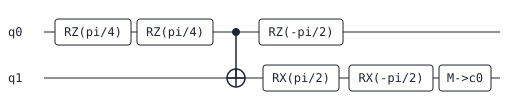
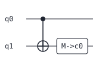

# Daedalus

[](https://github.com/GreenPandaTech/Daedalus/actions/workflows/ci.yml)

*Daedalus — the master craftsman who built the Labyrinth; this one crafts
quantum circuits and proves its rewrites never lose the way.*

**A toy educational quantum-circuit compiler with *verified* optimization
passes. Pure Python stdlib — zero runtime dependencies.**

Daedalus compiles a small quantum-circuit DSL through a real compiler pipeline
(lexer -> recursive-descent parser -> IR -> pass manager) and then *proves*
its optimizations did not change the circuit's meaning, using a built-in
statevector simulator and an up-to-global-phase equivalence check.

> **Honest framing:** this is a toy compiler for learning and portfolio
> purposes. It demonstrates genuine compiler architecture and genuinely
> verified rewrites, but it is not a production quantum compiler (no
> hardware backends, no routing, no noise models — see Limitations).

## Why it is interesting

Most toy compilers *claim* their optimizations are correct. Daedalus checks:
every optimized circuit is re-simulated against the original on a set of
deterministic basis states and seeded pseudo-random inputs, and must match
up to global phase. The test suite uses the same machinery to prove each
pass is semantics-preserving.

```
$ daedalus compile examples/rotations.qf --opt --emit ascii --verify
verify: equivalent up to global phase (max error 2.483e-16, 8 inputs)
BEFORE:
q0: -[RZ(pi/4)]--[RZ(pi/4)]---o---[RZ(-pi/2)]-----------------------
                              |
q1: -------------------------(+)--[RX(pi/2)]---[RX(-pi/2)]--[M->c0]-

AFTER:
q0: --o-----------
      |
q1: -(+)--[M->c0]-

gates: 7 -> 2
```

Seven gates collapse to two: the adjacent `rz(pi/4)` pair merges to
`rz(pi/2)`, which *commutes through the cx control* and cancels against
`rz(-pi/2)`; the `rx` pair merges to `rx(0)` and evaporates.

## The DSL

```
# Bell pair with a redundant x x pair the optimizer removes.
qubits 2
bits 2
h q0
x q1
x q1
cx q0, q1
measure q0 -> c0
measure q1 -> c1
```

DSL source files use the `.qf` extension — a short, stable extension for
quantum-circuit source that existing programs and tooling keep using
unchanged.

Gates: `h x y z s sdg t tdg rx(a) ry(a) rz(a) cx cz swap measure`.
Angles support pi arithmetic (`pi/4`, `-pi/2`, `2*pi`) via a tiny safe
expression evaluator — no `eval`. Parse errors carry line and column:

```
bad.qf:2:1: error: unknown gate 'foo'
```

## Optimization passes

| pass | what it does |
|---|---|
| `cancel-inverses` | removes adjacent self-inverse pairs (`h h`, `x x`, `cx cx`, `s sdg`, `t tdg`, ...) |
| `merge-rotations` | fuses adjacent same-axis rotations, drops angles that are 0 mod 2pi |
| `peephole` | algebraic identities: `h x h -> z`, `h z h -> x` |
| `commute-cancel` | commutes z-diagonal gates through cx controls to expose cancellations |
| `dead-code` | *(off by default, `--dce`)* drops gates on never-measured qubits; documented as observably unsafe if you inspect the full state |

The pass manager runs passes to a fixpoint and reports per-pass statistics:

```
$ daedalus stats examples/bell.qf
pass               iter  before  after  removed
cancel-inverses       1       6      4        2
merge-rotations       1       4      4        0
...
total: 6 -> 4 gates (33.3% reduction)
```

## Install & run

Requires Python 3.10+ (developed on 3.13). Zero runtime dependencies;
`pytest` is the only dev dependency.

```bash
python -m venv .venv
.venv/Scripts/python.exe -m pip install -e ".[dev]"   # Windows
# .venv/bin/python -m pip install -e ".[dev]"          # Linux/macOS

.venv/Scripts/python.exe -m pytest -q                  # 244 tests
```

CLI (also runnable as `python -m daedalus`):

```
daedalus compile FILE [--opt] [--emit ir|ascii|svg|qasm] [--verify] [--dce] [--out FILE]
daedalus stats FILE
```

Files ending in `.qasm` are parsed as OpenQASM 2.0 (see below); everything
else is parsed as the DSL.

Exit codes: `0` success (and verification passed), `1` compile/verify
failure, `2` usage errors.

SVG diagrams (committed under `examples/`, regenerable with
`daedalus compile examples/bell.qf --opt --emit svg --out ...`):

| before | after `--opt` |
|---|---|
|  |  |
|  |  |

## OpenQASM 2.0 interop

Any circuit can be exported to OpenQASM 2.0 with `--emit qasm` (or
`daedalus.emit_qasm`), and `.qasm` files compile directly. Real observed run:

```
$ daedalus compile examples/bell.qf --opt --verify --emit qasm
verify: equivalent up to global phase (max error 0.000e+00, 8 inputs)
OPENQASM 2.0;
include "qelib1.inc";
qreg q[2];
creg c[2];
h q[0];
cx q[0],q[1];
measure q[0] -> c[0];
measure q[1] -> c[1];
```

Feeding that file back in (`daedalus compile bell.qasm --emit ir`) recovers the
DSL circuit; the test suite round-trips every example program (and its
optimized form) through QASM and re-proves equivalence with the statevector
checker.

**Honest subset caveats.** The importer accepts a documented *subset* of
OpenQASM 2.0, not the full language:

- one `qreg` and at most one `creg` (any names — they are re-emitted as
  `q`/`c`), sizes >= 1;
- the qelib1 gates `h x y z s sdg t tdg rx ry rz cx cz swap` plus
  `measure q[i] -> c[j]`, with indexed operands only (no whole-register
  broadcast like `h q;`);
- angle expressions over numbers (exponent notation included), `pi`,
  `+ - * /`, and parentheses;
- `//` comments; free-form whitespace.

User-defined `gate` blocks, `if`, `barrier`, `opaque`, `reset`, and the
bare `U`/`CX` builtins are rejected with the same precise `line:col`
diagnostics as the DSL parser, e.g.

```
bad.qasm:3:1: error: 'barrier' is not supported
```

The emitter writes angles as plain floats (`rz(0.7853981633974483)`), so a
DSL -> QASM -> DSL round trip loses the `pi/4` *spelling* but preserves the
value bit-exactly.

## Architecture

```
src/daedalus/
  lexer.py       tokenizer with line/column tracking
  parser.py      recursive-descent parser -> Circuit IR
  angles.py      safe pi-arithmetic expression evaluator (no eval)
  ir.py          Circuit/Gate IR; per-qubit dependency chains (a DAG
                 linearized in program order)
  passes/        one module per optimization pass + the fixpoint manager
  sim.py         pure-stdlib statevector simulator (complex lists, <=10 qubits)
  verify.py      up-to-global-phase equivalence checker (basis + seeded
                 pseudo-random inputs)
  draw_ascii.py  aligned-column ASCII circuit diagrams
  draw_svg.py    hand-rolled SVG writer (no deps)
  qasm.py        OpenQASM 2.0 emitter + documented-subset importer
  cli.py         argparse CLI
tests/           244 pytest tests: parser errors by position, every pass,
                 hand-computed amplitudes (Bell/GHZ), equivalence checker
                 positive AND negative cases, SVG well-formedness, QASM
                 exact-output/roundtrip/error-position checks, CLI e2e
```

Why the IR is "effectively a DAG": gates are stored in program order, but
each gate only constrains gates that share a qubit; per-qubit chains are the
DAG edges, and passes exploit commutation within them.

## Safety & privacy

Runs fully offline; no network, no telemetry. The angle evaluator is a
whitelisted mini-parser, not `eval`. All examples are synthetic.

## Limitations

- Statevector simulation is exponential; the simulator refuses >10 qubits.
- Measurement is modelled as a marker, not a collapse: the simulator
  compares *pre-measurement* statevectors and passes never move or alter
  `measure` gates. There is no classical control flow.
- Verification samples inputs (8 per check) — overwhelming evidence, not a
  formal proof.
- No hardware backends, transpilation targets, routing, or noise models.
- The commutation pass only handles z-diagonal gates through cx controls —
  intentionally the simplest genuinely useful case.

## Roadmap

- Controlled-phase fusion and a T-count report.
- A `--proof` mode emitting the unitary difference norm for small circuits.
- Gate-count-vs-depth pareto stats.

## License

MIT. Copyright (c) 2026 GreenPandaTech. See `LICENSE`.
